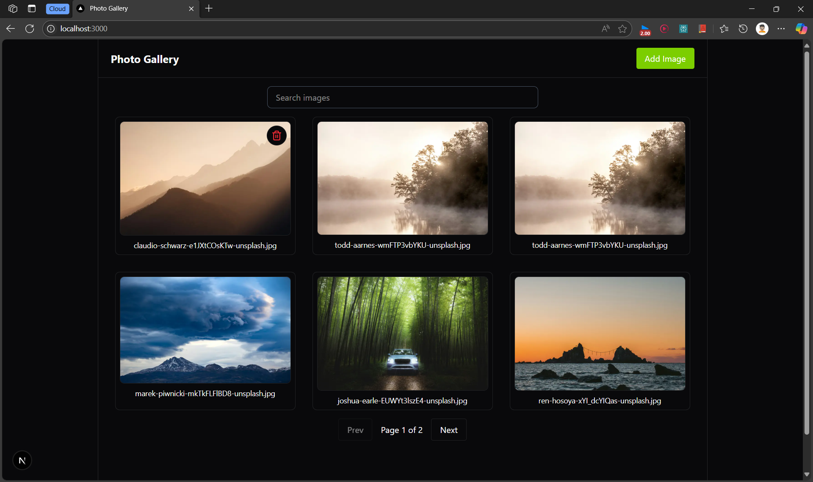
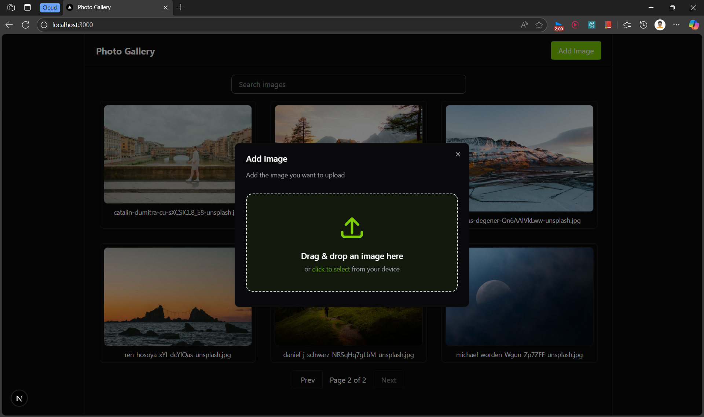

# Photo Gallery

## Description

A simple photo gallery app built with Next.js and Convex. Easily upload, view, search, and manage your images with a modern UI and real-time updates.

## Features

- Upload images with drag-and-drop
- View images in a responsive grid
- Search images by name
- Pagination for easy browsing
- Delete images with confirmation
- Loading skeletons and toasts for feedback
- Dark mode support

## Tech Stack

- **Next.js** – React framework for server-side rendering and routing
- **Convex** – Backend-as-a-service for real-time data and file storage
- **React Dropzone** – Drag-and-drop file uploads
- **React Icons** – Icon library for React
- **Tailwind CSS** – Utility-first CSS framework
- **Sonner** – Toast notifications
